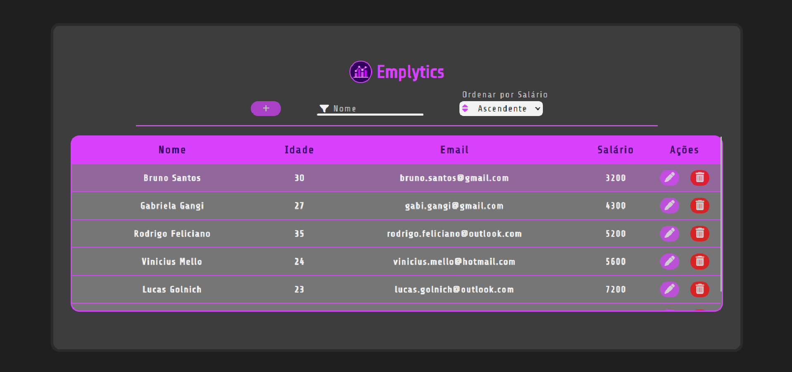

  
  
  
  <h1>Emplytics</h1>

 🔗Conteudo
   <ol>
      <a href="#tecs">Tecnologias</a>
      <a href="#about">Sobre</a>
   </ol>

<h2 id="tecs">💻 Tecnologias</h2>

  
  
  

<h2 id="about">🔍 Sobre</h2>

Projeto realizado por mim para praticar logica em programação

O projeto consiste em uma tabela de funcionários de uma empresa, na qual são exibidas informações como nome, idade, email e salário dos funcionários. Além disso, é possível adicionar, editar e excluir os funcionários da tabela. Durante o desenvolvimento, pratiquei a manipulação de modais e realizei um modal de confirmação que permite ao usuário confirmar ou cancelar a exclusão do funcionário selecionado. Essa funcionalidade adiciona uma camada extra de segurança, evitando exclusões acidentais e fornecendo uma experiência mais intuitiva ao usuário.

Além das funcionalidades já mencionadas, o projeto também inclui recursos adicionais para melhorar a usabilidade e a experiência do usuário. Implementei a capacidade de filtrar os funcionários por nome, permitindo que o usuário pesquise um funcionário específico e filtre os resultados com base no nome fornecido. Isso proporciona uma maneira rápida e eficiente de encontrar informações específicas na tabela, além disso, adicionei a capacidade de ordenar os funcionários por salário, oferecendo ao usuário a opção de selecionar entre ordem crescente e decrescente. Essa funcionalidade permite que os usuários organizem os dados de acordo com suas preferências, facilitando a identificação de padrões e a análise dos dados na tabela.

(<a href="#home">⬆️</a>)

